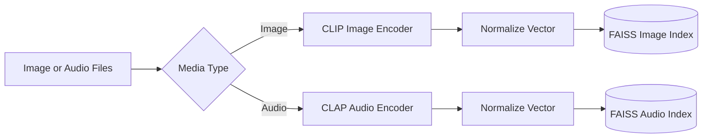
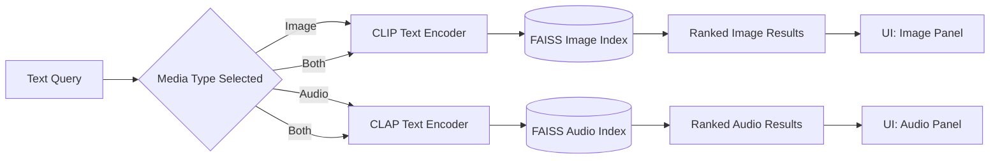

# RAG Knowledge Base QA

A Retrieval-Augmented Generation (RAG) system for answering questions from custom text and video subtitle datasets with grounded answers and source citations.

**Status:** Core RAG pipeline, FastAPI service, and minimal Streamlit UI implemented.

## Architecture

Ingestion -> Chunking -> Embedding -> Vector Store -> Retrieval -> Generation -> API/UI

## Tech Stack

- Python
- ChromaDB
- Ollama (default local generation)
- OpenAI API (optional)
- Anthropic API (optional)
- Sentence Transformers (optional local embeddings and reranking)
- Tiktoken
- FastAPI and Uvicorn
- Streamlit

## Implemented

- Text, PDF, SRT, and simple WebVTT ingestion
- Subtitle formatting cleanup and timestamp parsing
- Token-aware text chunking with overlap
- Subtitle chunking with start/end timestamps
- OpenAI embeddings using `text-embedding-3-small`
- Local embeddings using `sentence-transformers/all-MiniLM-L6-v2`
- Persistent ChromaDB storage with deterministic IDs
- Duplicate-safe vector upserts when re-indexing files
- Similarity retrieval with score filtering and top-k limits
- Hybrid BM25 + vector retrieval with configurable score blending
- Optional LLM query rewriting with conversation-aware reference resolution
- Optional cross-encoder reranking
- Grounded generation with Ollama, OpenAI, or Anthropic
- Numbered source citations and timestamp metadata
- Exact fallback response when context is insufficient
- Unit tests for chunking, vector storage, retrieval, and generation

## Project Structure

```text
src/
  ingestion.py       # Load TXT, PDF, SRT, and VTT documents
  chunking.py        # Create token-aware chunks
  embeddings.py      # OpenAI and local embedding providers
  vector_store.py    # Persistent ChromaDB wrapper
  index.py           # Ingestion -> chunking -> embedding -> storage CLI
  retrieval.py       # Similarity search and optional reranking
  keyword_search.py   # Cached BM25 keyword search
  query_rewrite.py    # Optional LLM query rewriting
  prompts.py         # Grounded generation prompt
  generation.py      # Ollama/OpenAI/Anthropic answer generation
api.py               # FastAPI endpoints
app.py               # Streamlit frontend
config.py            # Environment-backed application settings
data/sample/         # Example TXT and SRT files
data/uploads/        # Streamlit-uploaded files
tests/               # Module tests
```

## Setup

Create and activate a virtual environment, then install dependencies:

```bash
python -m venv .venv
# Windows PowerShell
.venv\Scripts\Activate.ps1
# macOS/Linux
source .venv/bin/activate

pip install -r requirements.txt
pip install pytest
```

Copy `.env.example` to `.env` and configure the providers you want to use:

```env
EMBEDDING_PROVIDER=local
EMBEDDING_MODEL=sentence-transformers/all-MiniLM-L6-v2
GENERATION_PROVIDER=ollama
OLLAMA_MODEL=llama3.1:8b
OLLAMA_BASE_URL=http://localhost:11434
CHROMA_PATH=./chroma_db
COLLECTION_NAME=rag_knowledge
USE_RERANKER=false
USE_QUERY_REWRITE=false
```

### Run fully free, no API keys

1. Install [Ollama](https://ollama.com).
2. Download the default model: `ollama pull llama3.1:8b`
3. Install Python dependencies: `pip install -r requirements.txt`
4. Set `EMBEDDING_PROVIDER=local` and `GENERATION_PROVIDER=ollama` in `.env` (the `.env.example` defaults already use these settings).
5. Run the app using the API/UI commands below.

Local embeddings download `sentence-transformers/all-MiniLM-L6-v2` on first use. After that download, the default configuration runs without API keys or hosted services. Query rewriting is disabled by default in `.env.example` because the optional rewrite feature uses OpenAI.

For OpenAI generation, set `GENERATION_PROVIDER=openai`, `GENERATION_MODEL=gpt-4o-mini`, and provide `OPENAI_API_KEY`. For Anthropic generation, set `GENERATION_PROVIDER=anthropic`, `GENERATION_MODEL=claude-sonnet-4-6`, and provide `ANTHROPIC_API_KEY`. These hosted providers are optional alternatives and are not required for the local setup.

## Usage

### Index a document

```bash
python -m src.index data/sample/example.txt
python -m src.index data/sample/example.srt
```

The indexer loads the document, chunks it, creates embeddings, and upserts it into the persistent ChromaDB collection.

### Retrieve relevant chunks

```bash
python -m src.retrieval --query "What is the main idea?" --k 5
```

Enable optional reranking with `USE_RERANKER=true`. Reranking improves ordering in some cases but adds model-loading time, memory usage, and latency.

The API uses hybrid retrieval by default. `alpha=1.0` is vector-only, `alpha=0.0` is BM25-only, and values between them blend both signals. Query rewriting can be disabled per request with `rewrite=false` or globally with `USE_QUERY_REWRITE=false`.

### Generate an answer

```bash
python -m src.generation --query "What is the main idea?" --k 5
```

Generated answers use only retrieved context. Claims are expected to include numbered citations such as `[1]` and `[2]`. When the context does not contain an answer, the generator returns:

```text
I don't have enough information to answer that.
```

### Use ingestion and chunking from Python

```python
from src.ingestion import load_document
from src.chunking import chunk_subtitles, chunk_text

document = load_document("data/sample/example.txt")
chunks = chunk_text(document, chunk_size=500, overlap=50, source="example.txt")

subtitles = load_document("data/sample/example.srt")
subtitle_chunks = chunk_subtitles(subtitles, max_tokens=300, source="example.srt")
```

## Tests

Run all tests with:

```bash
pytest
```

## API and UI

Start the FastAPI server:

```bash
uvicorn src.api:app --reload
```

In a second terminal, start the Streamlit frontend:

```bash
streamlit run app.py
```

The API provides:

- `GET /health` - health check
- `POST /query` - answer a question using the RAG pipeline
- `POST /index` - index a file or folder of supported documents
- `GET /sources` - list indexed source filenames

Example API requests:

```bash
curl http://localhost:8000/health
curl -X POST http://localhost:8000/index -H "Content-Type: application/json" -d "{\"path\": \"data/sample/example.txt\"}"
curl -X POST http://localhost:8000/query -H "Content-Type: application/json" -d "{\"query\": \"What is the main idea?\", \"k\": 5, \"alpha\": 0.5, \"rewrite\": true}"
```

The Streamlit UI uploads documents into `data/uploads/`, indexes them through the API, displays indexed sources, and provides a question-answering interface with cited chunks. Set `API_URL` if the API is running somewhere other than `http://localhost:8000`.

## Evaluation

The evaluation harness in `eval/` runs 12 hand-written questions against the sample TXT and SRT documents. It evaluates retrieval and generation separately, including three questions that should trigger the fallback response.

Run it after indexing the sample data and configuring your embedding and generation providers:

```bash
python -m src.index data/sample/example.txt
python -m src.index data/sample/example.srt
python -m eval.evaluate --k 5
```

The harness checks whether the expected source appears in the top-k retrieved chunks, whether answerable responses contain the expected key phrases, and whether unanswerable questions return the exact fallback message. Detailed per-question results are written to `eval/results/latest.json`; raw result files are ignored by Git, while `eval/results/sample.json` remains tracked as a format example.

### Local model trade-off

Fully local generation is free, private, and offline-capable, but a 7–8B model such as Llama 3.1 or Mistral may follow grounding and fallback instructions less reliably than larger hosted models. In particular, local models can cite unsupported chunks or answer questions that should return `I don't have enough information to answer that.` This is a model-quality trade-off, not a retrieval or configuration guarantee.

Compare the false-positive or hallucination rate across providers when reporting evaluation results. For example, a report might show `Local model hallucination rate: 15% vs OpenAI: 0%`; those figures are illustrative and must be replaced with measurements from the same evaluation set and configuration. The `False Positive Rate` metric below is intended to capture this difference.

### Evaluation Metrics

| Metric | Final result |
| --- | ---: |
| Retrieval Hit Rate @5 | -- |
| Answer Accuracy | -- |
| Fallback Precision | -- |
| **False Positive Rate** | **--** |

Retrieval Hit Rate measures how often the expected source appears in the top-k results for answerable questions. Answer Accuracy measures whether the generated answer contains the expected key phrases. Fallback Precision measures how often unanswerable questions correctly receive the fallback response.

False Positive Rate is the most important safety metric here: it measures how often the system gives an answer when the context does not support one. A lower value means fewer unsupported or hallucinated answers.

## Planned multimodal extension

The current repository implements text/document RAG only. The following architecture is the planned extension for shared text-to-image and text-to-audio semantic search; the image/audio encoders and FAISS indexes are not currently part of this codebase.

### Indexing flow



### Search flow



**Key design point:** image and audio results are never merged or cross-ranked. CLIP and CLAP are separately trained models with unrelated embedding spaces, so a similarity score from one model is not comparable to a score from the other. When both media types are selected, the system should return separate ranked image and audio result panels.

### Reference multimodal evaluation

For a future multimodal implementation, evaluate 20 hand-labeled queries: 10 image and 10 audio, split between literal and abstract/semantic queries.

| Media | Difficulty | Hit@1 | Hit@5 |
|---|---|---:|---:|
| Image | Easy | 90% | 100% |
| Image | Hard | 60% | 80% |
| Audio | Easy | 85% | 95% |
| Audio | Hard | 50% | 70% |

Hit@k checks whether the expected file appears in the top-k results. Hard queries use indirect descriptions such as “something cozy” rather than literal object or sound names. Lower hard-query accuracy is expected and reflects semantic-grounding limits in CLIP/CLAP, rather than necessarily indicating an implementation defect.
